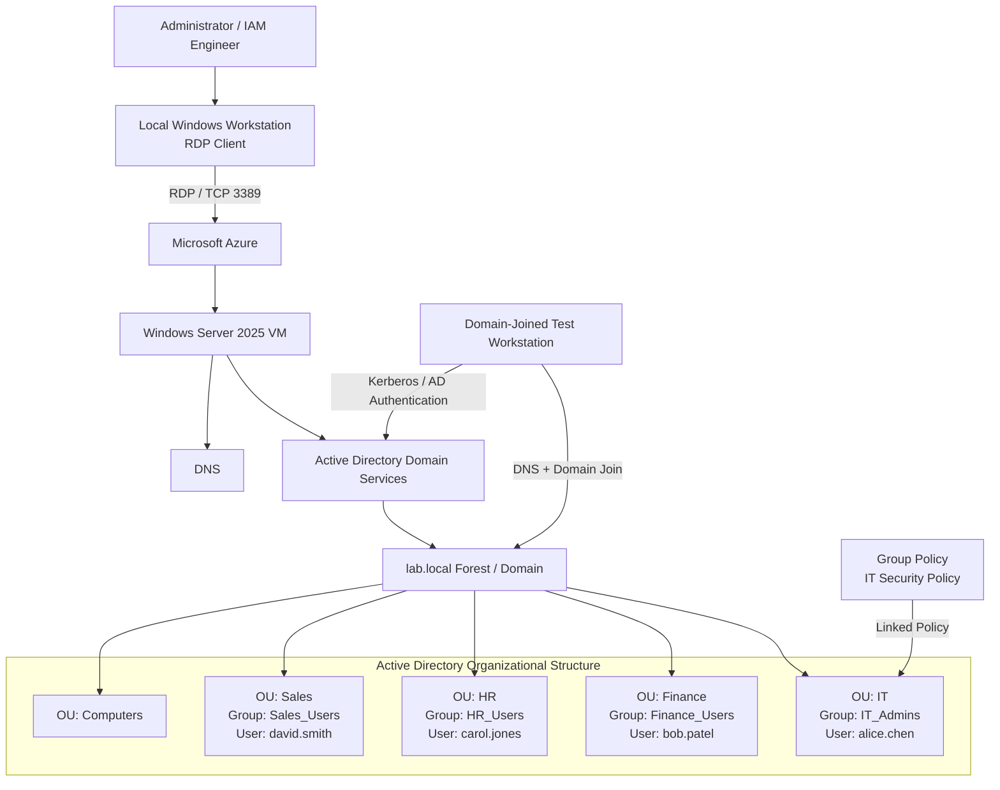

# Active Directory IAM Lab --- Windows Server 2025 on Microsoft Azure

> **Hands-on Identity & Access Management lab demonstrating Active
> Directory Domain Services (AD DS), domain controller deployment,
> organizational unit design, security groups, RBAC, Group Policy, user
> lifecycle administration, PowerShell automation, and validation in an
> Azure-hosted Windows Server environment.**

## Project Overview

This lab builds a functional Microsoft Active Directory environment from
the ground up using **Windows Server 2025** hosted on a **Microsoft
Azure virtual machine**.

The project demonstrates foundational enterprise Identity & Access
Management (IAM) and Windows administration skills: deploying a domain
controller, creating an Active Directory forest and domain, structuring
identities with Organizational Units (OUs), creating users and security
groups, assigning role-based access, configuring Group Policy, and
performing common account lifecycle operations.

The lab domain is:

``` text
lab.local
```

The environment is intentionally designed as a small enterprise-style
identity lab that can be expanded later into hybrid identity, Microsoft
Entra ID, application SSO, PAM, or identity governance projects.

------------------------------------------------------------------------

## Business Scenario

Organizations need a centralized way to determine:

-   Who a user is
-   How that user authenticates
-   Which resources the user can access
-   Which security policies apply to the user or device
-   How access changes when an employee joins, changes roles, or leaves

In this lab, **Active Directory Domain Services (AD DS)** provides that
centralized identity and access layer.

Departmental OUs and security groups are used to organize identities and
establish a basic **role-based access control (RBAC)** model. Group
Policy provides centralized security enforcement, while PowerShell is
used to automate repeatable administrative tasks.

------------------------------------------------------------------------

## Architecture Diagram



### Architecture Flow

1.  The administrator connects from a local Windows workstation to the
    Azure-hosted Windows Server VM using **Remote Desktop Protocol
    (RDP)**.
2.  The Windows Server VM is configured with **Active Directory Domain
    Services** and promoted to a **Domain Controller**.
3.  A new Active Directory forest and domain named `lab.local` is
    created.
4.  Active Directory-integrated DNS supports domain discovery and
    authentication.
5.  Departmental OUs organize users and groups for IT, Finance, HR, and
    Sales.
6.  Global security groups provide department-based access assignments
    and establish the foundation for RBAC.
7.  An **IT Security Policy** GPO is linked to the IT OU.
8.  A test workstation can be joined to `lab.local` to validate domain
    authentication and Group Policy processing.

------------------------------------------------------------------------

## IAM Concepts Demonstrated

  IAM / Infrastructure Concept   Implementation
  ------------------------------ -----------------------------------------------
  Centralized Identity           Active Directory Domain Services
  Authentication                 Windows domain authentication
  Directory Services             `lab.local` Active Directory domain
  Identity Organization          Department-based Organizational Units
  RBAC                           Global security groups mapped to departments
  Least Privilege                Access assigned through role/group membership
  Policy Enforcement             Group Policy Objects
  Joiner Administration          User creation and group assignment
  Mover Administration           Group membership changes
  Leaver Administration          Account disablement
  Credential Management          Password reset and forced password change
  Account Recovery               Locked-account administration
  Automation                     PowerShell Active Directory cmdlets
  Audit / Reporting              Account and group membership queries

------------------------------------------------------------------------

## Technologies Used

-   Microsoft Azure
-   Windows Server 2025 Datacenter
-   Active Directory Domain Services (AD DS)
-   Active Directory Users and Computers (ADUC)
-   Group Policy Management Console (GPMC)
-   DNS
-   Windows PowerShell
-   Remote Desktop Protocol (RDP)
-   Azure Virtual Machines

------------------------------------------------------------------------

## Lab Environment

  Component               Configuration
  ----------------------- -----------------------------------------
  Cloud Platform          Microsoft Azure
  Server OS               Windows Server 2025 Datacenter --- Gen2
  VM Size                 Standard_B2s --- 2 vCPU / 4 GB RAM
  Domain                  `lab.local`
  NetBIOS Name            `LAB`
  Server Role             Domain Controller
  Directory Service       Active Directory Domain Services
  Remote Administration   RDP
  Management              Server Manager, ADUC, GPMC, PowerShell

------------------------------------------------------------------------

# Implementation

## Phase 1 --- Deploy the Windows Server VM

Create a Windows Server VM in Azure.

    Click Virtual machine


    Create -> Virtual Machine


    Virtual machine name - Region


    Image - Size - Username - Password - Review+create


    Create


    Go back to resource


    Connect - Connect


    Download RDP file


    Connect


    Enter VM password


    


After deployment, connect to the server using the VM's public IP address
and the native Windows Remote Desktop client.

### Enable Clipboard Redirection

Before connecting:

``` text
Remote Desktop Connection
→ Show Options
→ Local Resources
→ Local devices and resources
→ Enable Clipboard
```


This allows commands to be copied between the local workstation and the
lab VM.

> **Security note:** Exposing RDP directly to the Internet is acceptable
> only for a tightly controlled temporary lab. In production, restrict
> source IPs and use controls such as Azure Bastion, VPN/private
> connectivity, privileged access workstations, or equivalent secure
> administrative access.

------------------------------------------------------------------------

## Phase 2 --- Install Active Directory Domain Services

From **Server Manager**:

``` text
Manage
→ Add Roles and Features
→ Role-based or feature-based installation
→ Active Directory Domain Services
→ Add Features
→ Install
```


PowerShell alternative:


    Install-WindowsFeature -Name AD-Domain-Services -IncludeManagementTools


Install the Group Policy Management Console:

## Phase 3 --- Promote the Server to a Domain Controller

From Server Manager:

``` text
Notifications
→ Promote this server to a domain controller
```


Configure:

``` text
Add a new forest
Root domain name: lab.local
Next
```


Set a secure **Directory Services Restore Mode (DSRM)** password and
complete the promotion.

    Next -> Install


The server restarts automatically 

------------------------------------------------------------------------

## Phase 4 --- Build the Organizational Unit Structure

``` text
Server Manager
→ AD DS
→ Active Directory Users and Computers
```


Create the following OUs:

``` text
lab.local
New
Organization Unit
```


    Name -> OK


    Group name -> OK


### Why This Matters

OUs provide administrative organization and policy scope. They allow
administrators to target users and computers with specific Group
Policies instead of configuring every endpoint individually.

------------------------------------------------------------------------

## Phase 5 --- Create Security Groups

Create one Global Security group for each department:

  OU        Security Group
  --------- -----------------
  IT        `IT_Admins`
  Finance   `Finance_Users`
  HR        `HR_Users`
  Sales     `Sales_Users`

PowerShell:

``` powershell
New-ADGroup -Name "IT_Admins" -GroupScope Global -GroupCategory Security -Path "OU=IT,DC=lab,DC=local"

New-ADGroup -Name "Finance_Users" -GroupScope Global -GroupCategory Security -Path "OU=Finance,DC=lab,DC=local"

New-ADGroup -Name "HR_Users" -GroupScope Global -GroupCategory Security -Path "OU=HR,DC=lab,DC=local"

New-ADGroup -Name "Sales_Users" -GroupScope Global -GroupCategory Security -Path "OU=Sales,DC=lab,DC=local"
```

### IAM Significance

Instead of assigning access directly to individual users, enterprise IAM
environments typically assign entitlements through groups or roles.

Conceptually:

``` text
User → Department / Job Role → Security Group → Resource Access
```

This improves scalability, consistency, auditing, and offboarding.

------------------------------------------------------------------------

## Phase 6 --- Provision Test Identities

The lab provisions four users:

  User          Department   Security Group
  ------------- ------------ -----------------
  Alice Chen    IT           `IT_Admins`
  Bob Patel     Finance      `Finance_Users`
  Carol Jones   HR           `HR_Users`
  David Smith   Sales        `Sales_Users`

For GitHub-safe automation, prompt for the temporary password rather
than storing it in the repository:

``` powershell
$password = Read-Host "Enter temporary user password" -AsSecureString

New-ADUser -Name "alice.chen" `
    -GivenName "Alice" `
    -Surname "Chen" `
    -SamAccountName "alice.chen" `
    -UserPrincipalName "alice.chen@lab.local" `
    -Path "OU=IT,DC=lab,DC=local" `
    -AccountPassword $password `
    -Enabled $true

New-ADUser -Name "bob.patel" `
    -GivenName "Bob" `
    -Surname "Patel" `
    -SamAccountName "bob.patel" `
    -UserPrincipalName "bob.patel@lab.local" `
    -Path "OU=Finance,DC=lab,DC=local" `
    -AccountPassword $password `
    -Enabled $true

New-ADUser -Name "carol.jones" `
    -GivenName "Carol" `
    -Surname "Jones" `
    -SamAccountName "carol.jones" `
    -UserPrincipalName "carol.jones@lab.local" `
    -Path "OU=HR,DC=lab,DC=local" `
    -AccountPassword $password `
    -Enabled $true

New-ADUser -Name "david.smith" `
    -GivenName "David" `
    -Surname "Smith" `
    -SamAccountName "david.smith" `
    -UserPrincipalName "david.smith@lab.local" `
    -Path "OU=Sales,DC=lab,DC=local" `
    -AccountPassword $password `
    -Enabled $true
```

Assign group memberships:

``` powershell
Add-ADGroupMember -Identity "IT_Admins" -Members "alice.chen"
Add-ADGroupMember -Identity "Finance_Users" -Members "bob.patel"
Add-ADGroupMember -Identity "HR_Users" -Members "carol.jones"
Add-ADGroupMember -Identity "Sales_Users" -Members "david.smith"
```

###

------------------------------------------------------------------------

## Phase 7 --- Configure Group Policy

Open:

``` text
Server Manager
→ Tools
→ Group Policy Management
```

Navigate to:

``` text
Forest: lab.local
→ Domains
→ lab.local
→ IT
```

Create and link:

``` text
IT Security Policy
```

The source lab applies the following controls:

  Security Control           Lab Setting
  -------------------------- ---------------
  Minimum password length    12 characters
  Password complexity        Enabled
  Machine inactivity limit   900 seconds
  Removable storage access   Denied

### Important AD Design Note

Domain account password policy is normally configured at the **domain
level** through the domain password policy, or with **Fine-Grained
Password Policies** when different password requirements are needed for
selected users/groups. A password policy configured only in a GPO linked
to an OU does not create a different domain-password policy for the user
accounts in that OU.

For the portfolio implementation, treat the screen-lock and
removable-storage settings as OU-targeted controls and document password
policy separately as a domain-level identity control.

### Validate Group Policy

On the target machine:

``` powershell
gpupdate /force
gpresult /r
```

For deeper reporting:

``` powershell
gpresult /h C:\Temp\gp-report.html
```

------------------------------------------------------------------------

## Phase 8 --- Perform Identity Lifecycle Operations

### Password Reset

``` powershell
$newPassword = Read-Host "Enter new temporary password" -AsSecureString

Set-ADAccountPassword `
    -Identity "bob.patel" `
    -Reset `
    -NewPassword $newPassword

Set-ADUser `
    -Identity "bob.patel" `
    -ChangePasswordAtLogon $true
```

This models a common service-desk credential recovery process.

### Unlock an Account

``` powershell
Unlock-ADAccount -Identity "carol.jones"
```

### Disable an Account

``` powershell
Disable-ADAccount -Identity "david.smith"
```

This models the **leaver/offboarding** stage of the identity lifecycle.

Validate:

``` powershell
Search-ADAccount -AccountDisabled |
    Select-Object Name, SamAccountName
```

------------------------------------------------------------------------

## Phase 9 --- Identity Audit and Reporting

Find enabled accounts that have not logged in within 90 days:

``` powershell
$cutoff = (Get-Date).AddDays(-90)

Get-ADUser `
    -Filter {LastLogonDate -lt $cutoff -and Enabled -eq $true} `
    -Properties LastLogonDate |
    Select-Object Name, SamAccountName, LastLogonDate
```

Review a user's group memberships:

``` powershell
Get-ADPrincipalGroupMembership -Identity "alice.chen" |
    Select-Object Name
```

These queries demonstrate basic identity hygiene and access-review
concepts.

------------------------------------------------------------------------

# Validation Checklist

  -----------------------------------------------------------------------------------------------------
  Test                    Command / Method                                      Expected Result
  ----------------------- ----------------------------------------------------- -----------------------
  Domain Controller       `Get-ADDomainController`                              DC information returned

  Domain                  `Get-ADDomain`                                        `lab.local` returned

  Forest                  `Get-ADForest`                                        Forest information
                                                                                returned

  OUs                     `Get-ADOrganizationalUnit -Filter *`                  Department OUs listed

  Enabled Users           `Get-ADUser -Filter {Enabled -eq $true}`              Active test accounts
                                                                                returned

  IT Membership           `Get-ADGroupMember IT_Admins`                         `alice.chen` returned

  GPO Link                `Get-GPInheritance -Target "OU=IT,DC=lab,DC=local"`   IT Security Policy
                                                                                visible

  Client Policy           `gpresult /r`                                         Applicable policies
                                                                                displayed
  -----------------------------------------------------------------------------------------------------

------------------------------------------------------------------------

# Troubleshooting

## PowerShell Prompts for `Name`

**Cause:** The `New-ADUser` command was executed incorrectly or required
variables were not initialized.

**Resolution:** Define the password variable first and run the complete
user-creation command.

------------------------------------------------------------------------

## Clipboard Does Not Work in RDP

Open:

``` text
Remote Desktop
→ Show Options
→ Local Resources
→ Clipboard
```

Enable **Clipboard**, disconnect, and reconnect.

------------------------------------------------------------------------

## Domain Controller Promotion Fails Because of DNS

Confirm that the server has appropriate DNS configuration and that its
network settings are stable before promotion.

After promotion, validate:

``` powershell
Get-DnsClientServerAddress
dcdiag /test:dns
```

------------------------------------------------------------------------

## GPO Does Not Apply

Run:

``` powershell
gpupdate /force
gpresult /r
```

Confirm that:

-   The object is in the intended OU.
-   The GPO is linked to the correct scope.
-   Security filtering permits the target.
-   The policy applies to the correct configuration context (Computer or
    User).

------------------------------------------------------------------------

## User Cannot Log In

Check:

``` powershell
Get-ADUser -Identity "alice.chen" -Properties Enabled,LockedOut
```

Verify that the account is enabled, not locked, has a valid password,
and the client can locate the domain controller through DNS.

------------------------------------------------------------------------

# Security Considerations

This is a lab environment. A production Active Directory deployment
requires additional controls.

Key improvements would include:

-   Multiple Domain Controllers for resiliency
-   Restricted administrative access
-   Separate privileged and standard user accounts
-   Tiered administration / privileged access strategy
-   Secure RDP administration or Azure Bastion
-   Network segmentation
-   Centralized logging and monitoring
-   Microsoft Defender integration
-   Strong domain password and lockout policies
-   Windows LAPS for local administrator passwords
-   Protected administrative groups
-   Regular privileged-access reviews
-   Backup and tested AD recovery procedures
-   Fine-Grained Password Policies where justified
-   Removal of hard-coded credentials from automation

------------------------------------------------------------------------

# Skills Demonstrated

This project demonstrates hands-on experience with:

-   Active Directory Domain Services
-   Microsoft Azure Virtual Machines
-   Windows Server administration
-   Domain Controller deployment
-   Active Directory forest and domain configuration
-   DNS fundamentals
-   Organizational Unit design
-   User and group administration
-   Role-Based Access Control (RBAC)
-   Least-privilege concepts
-   Group Policy administration
-   Identity lifecycle management
-   Joiner / Mover / Leaver concepts
-   Account provisioning and deprovisioning
-   Password and lockout administration
-   PowerShell automation
-   Identity auditing and reporting
-   Troubleshooting authentication and policy issues
-   Technical documentation

------------------------------------------------------------------------

# Key Takeaways

This lab demonstrates more than simply creating Active Directory users.

It shows the relationship between **identity, authentication,
authorization, policy, lifecycle management, automation, and auditing**
in a centralized enterprise directory.

The project establishes a foundation that can be extended into more
advanced IAM architectures such as:

``` text
Active Directory
        ↓
Microsoft Entra ID
        ↓
SSO / MFA / Conditional Access
        ↓
Enterprise Applications
        ↓
Identity Governance / PAM
```

------------------------------------------------------------------------

## Recommended Repository Structure

``` text
active-directory-iam-lab/
│
├── README.md
│
├── diagrams/
│   └── architecture.png
│
├── screenshots/
│   ├── 01-azure-vm.png
│   ├── 02-ad-ds-installed.png
│   ├── 03-domain-controller.png
│   ├── 04-ou-structure.png
│   ├── 05-security-groups.png
│   ├── 06-users.png
│   ├── 07-group-policy.png
│   └── 08-validation.png
│
├── scripts/
│   ├── create-ous.ps1
│   ├── create-groups.ps1
│   ├── create-users.ps1
│   └── validation.ps1
│
└── docs/
    ├── implementation-guide.md
    └── troubleshooting.md
```

> The Mermaid diagram in this README renders directly on GitHub. If a
> PNG architecture diagram is added later, place it in
> `diagrams/architecture.png` and reference it from this section.

------------------------------------------------------------------------

## Future Enhancements

Potential next phases for this lab:

-   Add a second Domain Controller
-   Deploy a Windows client and join it to `lab.local`
-   Implement AGDLP-style resource authorization
-   Configure domain password and account-lockout policies
-   Deploy Windows LAPS
-   Configure Microsoft Entra Connect / Cloud Sync
-   Synchronize identities to Microsoft Entra ID
-   Configure hybrid identity
-   Integrate an enterprise application using SAML or OIDC
-   Automate additional JML workflows with PowerShell
-   Add privileged access controls
-   Centralize identity and security logs

------------------------------------------------------------------------

## Project Status

**Completed --- Core Active Directory IAM Lab**

This repository documents a hands-on lab environment built for practical
IAM, Windows Server, cloud infrastructure, and security administration
experience.
