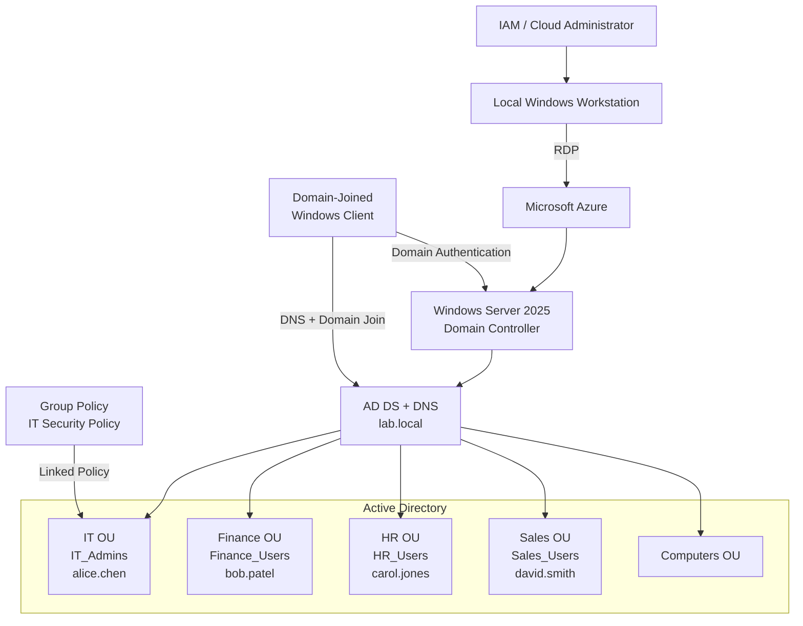

# Active Directory IAM Lab --- Windows Server 2025 on Microsoft Azure

> **Hands-on IAM and cloud infrastructure project demonstrating Active
> Directory Domain Services (AD DS), Domain Controller deployment, OU
> design, security groups, RBAC, Group Policy, domain workstation
> management, identity lifecycle administration, PowerShell automation,
> and validation in Azure.**

## Project Overview

This project builds a functional **Active Directory Domain Services (AD
DS)** environment using **Windows Server 2025** hosted in **Microsoft
Azure**.

The lab models a Windows enterprise identity foundation. A Windows
Server VM is deployed in Azure and promoted to a Domain Controller for
`lab.local`. Departmental Organizational Units (OUs), users, and
security groups are created; group-based access concepts are
implemented; Group Policy is configured; a workstation is domain joined;
and common identity lifecycle operations are performed.

``` text
Identity → Authentication → Group Membership → Authorization → Security Policy → Managed Resources
```

## Business Scenario

Organizations need a centralized identity platform to control who can
authenticate and what resources they can access. Active Directory
provides centralized identities, authentication, group-based
authorization, and policy enforcement.

A typical lifecycle represented by this lab is:

``` text
New Employee
     ↓
AD Account Created
     ↓
Department / Role Identified
     ↓
Security Group Membership
     ↓
Resource Access
     ↓
Policies Applied
```

When an employee changes roles, group membership can be modified. During
offboarding, disabling the account prevents future authentication while
preserving the identity for administrative and audit requirements.

## Architecture Diagram



### Architecture Flow

1.  The administrator connects to the Azure-hosted Windows Server VM.
2.  Windows Server hosts **AD DS** and **DNS**.
3.  The server becomes the Domain Controller for `lab.local`.
4.  Department OUs organize users and groups.
5.  Global security groups provide a scalable authorization layer.
6.  Group Policy centrally enforces configuration/security settings.
7.  A Windows client joins the domain and authenticates against the
    Domain Controller.
8.  PowerShell provides repeatable administration and validation.

## IAM Concepts Demonstrated

  IAM Concept             Implementation
  ----------------------- -------------------------------------------
  Centralized Identity    Active Directory Domain Services
  Authentication          Windows domain authentication
  Authorization           Security-group membership
  RBAC Foundation         Department-based security groups
  Least Privilege         Access organized around role requirements
  Identity Organization   Departmental OUs
  Policy Enforcement      Group Policy
  Joiner                  Create account + assign group
  Mover                   Modify group/OU membership
  Leaver                  Disable account
  Credential Management   Password reset
  Account Recovery        Account unlock
  Audit / Reporting       AD PowerShell queries
  Automation              PowerShell AD cmdlets

## Technologies Used

-   Microsoft Azure
-   Azure Virtual Machines
-   Windows Server 2025 Datacenter
-   Active Directory Domain Services
-   Active Directory Users and Computers
-   DNS
-   Group Policy Management Console
-   Windows PowerShell
-   Remote Desktop
-   Windows domain-joined client

## Lab Environment

  Component        Configuration
  ---------------- -----------------------------------------
  Cloud            Microsoft Azure
  Server OS        Windows Server 2025 Datacenter --- Gen2
  VM Size          Standard_B2s
  Domain           `lab.local`
  NetBIOS          `LAB`
  Server Role      Domain Controller
  Directory        Active Directory Domain Services
  Administration   Server Manager / PowerShell
  Remote Access    RDP

## Project Objectives

-   Deploy Windows Server in Azure.
-   Install AD DS.
-   Promote the server to a Domain Controller.
-   Create the `lab.local` forest/domain.
-   Design departmental OUs.
-   Create users and security groups.
-   Implement group-based access concepts.
-   Configure Group Policy.
-   Join a Windows workstation to the domain.
-   Perform password resets, unlocks, and offboarding.
-   Query Active Directory for auditing/reporting.
-   Automate administration with PowerShell.
-   Validate and troubleshoot the environment.

# Implementation

## Step 1 --- Deploy Windows Server 2025 in Azure

From Azure:

``` text
Virtual Machines → Create → Azure Virtual Machine
```

  Setting          Lab Configuration
  ---------------- -----------------------------------------
  Region           East US
  Image            Windows Server 2025 Datacenter --- Gen2
  Size             Standard_B2s
  Authentication   Password
  Inbound Port     RDP / TCP 3389
  OS Disk          Standard SSD

### Screenshot

``` markdown

```

**What this demonstrates:** Deployment of cloud infrastructure required
to host the identity environment.

## Step 2 --- Connect with Remote Desktop

Connect to the VM's public IP using the native Windows Remote Desktop
client.

For clipboard redirection:

``` text
Show Options → Local Resources → Clipboard
```

### Screenshot

``` markdown

```

> **Security:** Internet-facing RDP should be tightly restricted in a
> lab. Production environments should use controls such as Azure
> Bastion, VPN/private connectivity, restricted source IPs, or other
> secure administrative access.

## Step 3 --- Install Active Directory Domain Services

From Server Manager:

``` text
Manage → Add Roles and Features → Active Directory Domain Services → Install
```

PowerShell:

``` powershell
Install-WindowsFeature -Name AD-Domain-Services -IncludeManagementTools
Install-WindowsFeature -Name GPMC
```

### Screenshot

``` markdown

```

### Validation

``` powershell
Get-WindowsFeature AD-Domain-Services, GPMC
```

## Step 4 --- Promote the Server to a Domain Controller

Navigate to:

``` text
Server Manager → Notifications → Promote this server to a domain controller
```

Configure:

``` text
Deployment: Add a new forest
Root domain: lab.local
NetBIOS: LAB
DNS: Installed
```

### Screenshot

``` markdown

```

Secure PowerShell alternative:

``` powershell
Import-Module ADDSDeployment
$DSRMPassword = Read-Host "Enter DSRM password" -AsSecureString

Install-ADDSForest `
    -DomainName "lab.local" `
    -DomainNetBiosName "LAB" `
    -InstallDns:$true `
    -SafeModeAdministratorPassword $DSRMPassword `
    -Force:$true
```

> Credentials are intentionally not hard-coded in this portfolio
> version.

### Validation

``` powershell
Get-ADDomain
Get-ADForest
Get-ADDomainController
```

## Step 5 --- Create Organizational Units

Open:

``` text
Server Manager → Tools → Active Directory Users and Computers
```

Create:

``` text
lab.local
├── IT
├── Finance
├── HR
├── Sales
└── Computers
```

### Screenshot

``` markdown

```

PowerShell:

``` powershell
New-ADOrganizationalUnit -Name "IT" -Path "DC=lab,DC=local"
New-ADOrganizationalUnit -Name "Finance" -Path "DC=lab,DC=local"
New-ADOrganizationalUnit -Name "HR" -Path "DC=lab,DC=local"
New-ADOrganizationalUnit -Name "Sales" -Path "DC=lab,DC=local"
New-ADOrganizationalUnit -Name "Computers" -Path "DC=lab,DC=local"
```

**IAM significance:** OUs organize directory objects, support delegated
administration, and provide scopes for Group Policy.

## Step 6 --- Create Security Groups

  Department   Security Group
  ------------ -----------------
  IT           `IT_Admins`
  Finance      `Finance_Users`
  HR           `HR_Users`
  Sales        `Sales_Users`

### Screenshot

``` markdown

```

PowerShell:

``` powershell
New-ADGroup -Name "IT_Admins" -GroupScope Global -GroupCategory Security -Path "OU=IT,DC=lab,DC=local"
New-ADGroup -Name "Finance_Users" -GroupScope Global -GroupCategory Security -Path "OU=Finance,DC=lab,DC=local"
New-ADGroup -Name "HR_Users" -GroupScope Global -GroupCategory Security -Path "OU=HR,DC=lab,DC=local"
New-ADGroup -Name "Sales_Users" -GroupScope Global -GroupCategory Security -Path "OU=Sales,DC=lab,DC=local"
```

The authorization pattern becomes:

``` text
User → Business Role / Department → Security Group → Resource Permission
```

## Step 7 --- Provision Users

  User          Department   Group
  ------------- ------------ -----------------
  Alice Chen    IT           `IT_Admins`
  Bob Patel     Finance      `Finance_Users`
  Carol Jones   HR           `HR_Users`
  David Smith   Sales        `Sales_Users`

### Screenshot

``` markdown

```

Secure example:

``` powershell
$password = Read-Host "Enter temporary user password" -AsSecureString

New-ADUser -Name "alice.chen" -GivenName "Alice" -Surname "Chen" `
    -SamAccountName "alice.chen" -UserPrincipalName "alice.chen@lab.local" `
    -Path "OU=IT,DC=lab,DC=local" -AccountPassword $password -Enabled $true

New-ADUser -Name "bob.patel" -GivenName "Bob" -Surname "Patel" `
    -SamAccountName "bob.patel" -UserPrincipalName "bob.patel@lab.local" `
    -Path "OU=Finance,DC=lab,DC=local" -AccountPassword $password -Enabled $true

New-ADUser -Name "carol.jones" -GivenName "Carol" -Surname "Jones" `
    -SamAccountName "carol.jones" -UserPrincipalName "carol.jones@lab.local" `
    -Path "OU=HR,DC=lab,DC=local" -AccountPassword $password -Enabled $true

New-ADUser -Name "david.smith" -GivenName "David" -Surname "Smith" `
    -SamAccountName "david.smith" -UserPrincipalName "david.smith@lab.local" `
    -Path "OU=Sales,DC=lab,DC=local" -AccountPassword $password -Enabled $true
```

## Step 8 --- Assign Group Membership

``` powershell
Add-ADGroupMember -Identity "IT_Admins" -Members "alice.chen"
Add-ADGroupMember -Identity "Finance_Users" -Members "bob.patel"
Add-ADGroupMember -Identity "HR_Users" -Members "carol.jones"
Add-ADGroupMember -Identity "Sales_Users" -Members "david.smith"
```

### Screenshot

``` markdown

```

### Validation

``` powershell
Get-ADGroupMember "IT_Admins"
Get-ADGroupMember "Finance_Users"
Get-ADGroupMember "HR_Users"
Get-ADGroupMember "Sales_Users"
```

## Step 9 --- Configure Group Policy

Open:

``` text
Server Manager → Tools → Group Policy Management
```

Navigate to the IT OU and create:

``` text
IT Security Policy
```

### Screenshot

``` markdown

```

The lab includes:

  Control                        Lab Value
  -------------------------- -------------
  Minimum password length               12
  Password complexity              Enabled
  Machine inactivity limit     900 seconds
  Removable storage            Deny access

### Important AD Design Note

For **domain user accounts**, password and account-lockout policy is
normally configured through the domain-level password policy, or through
**Fine-Grained Password Policies** when different requirements are
needed for specific users/groups.

OU-linked GPOs can appropriately target many user/computer settings such
as inactivity controls and removable-storage restrictions.

This distinction makes the portfolio documentation reflect
production-quality AD design rather than reproducing a learning lab
without context.

## Step 10 --- Join a Windows Workstation to `lab.local`

Configure the workstation to use the Domain Controller for DNS, then
join:

``` text
System Properties
→ Computer Name
→ Change
→ Member of: Domain
→ lab.local
```

Restart after the successful join.

### Screenshot

``` markdown

```

### Validation

``` powershell
systeminfo | findstr /B /C:"Domain"
```

Expected:

``` text
Domain: lab.local
```

**IAM significance:** Domain joining establishes a trust relationship
between the endpoint and Active Directory so centralized authentication
and policy enforcement can occur.

## Step 11 --- Validate Group Policy

On the target workstation:

``` powershell
gpupdate /force
gpresult /r
```

Optional HTML report:

``` powershell
gpresult /h C:\gp-report.html
```

### Screenshot

``` markdown

```

# Identity Lifecycle Administration

## Step 12 --- Reset a Password

``` powershell
$newPassword = Read-Host "Enter new temporary password" -AsSecureString

Set-ADAccountPassword -Identity "bob.patel" -Reset -NewPassword $newPassword
Set-ADUser -Identity "bob.patel" -ChangePasswordAtLogon $true
```

### Screenshot

``` markdown

```

## Step 13 --- Unlock an Account

``` powershell
Unlock-ADAccount -Identity "carol.jones"
```

### Screenshot

``` markdown

```

## Step 14 --- Disable an Account for Offboarding

``` powershell
Disable-ADAccount -Identity "david.smith"
```

Validate:

``` powershell
Search-ADAccount -AccountDisabled | Select-Object Name, SamAccountName
```

### Screenshot

``` markdown

```

The lifecycle model is:

``` text
Employee Leaves → Identity Disabled → Authentication Blocked → Access Reviewed/Removed
```

# Audit & Reporting

## Step 15 --- Identify Inactive Accounts

``` powershell
$cutoff = (Get-Date).AddDays(-90)

Get-ADUser -Filter {LastLogonDate -lt $cutoff -and Enabled -eq $true} `
    -Properties LastLogonDate |
    Select-Object Name, SamAccountName, LastLogonDate
```

### Screenshot

``` markdown

```

## Step 16 --- Review Group Membership

``` powershell
Get-ADPrincipalGroupMembership -Identity "alice.chen" |
    Select-Object Name
```

### Screenshot

``` markdown

```

# Validation Checklist

  -----------------------------------------------------------------------------------------------------
  Test                    Command / Method                                      Expected Result
  ----------------------- ----------------------------------------------------- -----------------------
  Domain Controller       `Get-ADDomainController`                              DC returned

  Domain                  `Get-ADDomain`                                        `lab.local`

  OUs                     `Get-ADOrganizationalUnit -Filter *`                  Department OUs

  Enabled Users           `Get-ADUser -Filter {Enabled -eq $true}`              Active users

  IT Group                `Get-ADGroupMember IT_Admins`                         `alice.chen`

  GPO                     `Get-GPInheritance -Target "OU=IT,DC=lab,DC=local"`   IT policy linked

  Domain Join             `systeminfo`                                          `lab.local`

  Applied Policy          `gpresult /r`                                         Applicable GPOs
  -----------------------------------------------------------------------------------------------------

### Screenshot

``` markdown

```

# Troubleshooting

## PowerShell Prompts for `Name`

Ensure required variables are initialized and execute the complete
`New-ADUser` command.

## RDP Clipboard Does Not Work

``` text
Remote Desktop → Show Options → Local Resources → Clipboard
```

Reconnect after enabling clipboard redirection.

## DNS / Domain Promotion Problems

``` powershell
Get-DnsClientServerAddress
dcdiag /test:dns
```

Active Directory depends heavily on DNS.

## Client Cannot Join `lab.local`

Verify:

-   Client can reach the Domain Controller.
-   Client DNS points to the Domain Controller.
-   `lab.local` resolves.
-   AD DS/DNS services are running.
-   Valid domain credentials are used.

``` powershell
nslookup lab.local
```

## GPO Does Not Apply

``` powershell
gpupdate /force
gpresult /r
```

Confirm OU placement, GPO link, security filtering, and whether the
policy belongs under User or Computer Configuration.

## User Cannot Authenticate

``` powershell
Get-ADUser -Identity "alice.chen" -Properties Enabled,LockedOut,PasswordExpired
```

Confirm account status, credentials, DNS, and domain connectivity.

# Security Considerations

This is a learning environment. Production Active Directory should
include additional controls such as:

-   Multiple Domain Controllers
-   Dedicated privileged identities
-   Separate standard/admin accounts
-   Least-privilege delegated administration
-   Restricted Domain Admin membership
-   Windows LAPS
-   Secure privileged administrative access
-   Network segmentation
-   Centralized security logging
-   Domain-level password/lockout policy
-   Fine-Grained Password Policies when justified
-   Privileged-access reviews
-   AD backup and tested recovery
-   Stale-account monitoring
-   Protection of service accounts
-   No hard-coded credentials in scripts or repositories

# Skills Demonstrated

-   Active Directory Domain Services
-   Microsoft Azure Virtual Machines
-   Windows Server 2025
-   Domain Controller deployment
-   DNS
-   Organizational Unit design
-   User provisioning
-   Security-group administration
-   RBAC concepts
-   Least privilege
-   Group Policy
-   Domain joining
-   Joiner / Mover / Leaver concepts
-   Password and lockout administration
-   PowerShell automation
-   Identity auditing/reporting
-   Authentication troubleshooting
-   Technical documentation

# Project Results

``` text
Azure Infrastructure
       ↓
Windows Server 2025
       ↓
Active Directory Domain Services
       ↓
lab.local
       ↓
Users + OUs + Security Groups
       ↓
Group-Based Authorization
       ↓
Group Policy
       ↓
Domain-Joined Endpoint
       ↓
Lifecycle Administration
       ↓
Audit & Validation
```

**Outcome:** Successfully built an Azure-hosted Windows Server Active
Directory environment, created the `lab.local` forest/domain, structured
departmental identities and security groups, implemented group-based
authorization concepts, configured Group Policy, performed identity
lifecycle operations, and validated the environment with Windows and
PowerShell tools.

# Recommended Repository Structure

``` text
active-directory-azure-iam-lab/
│
├── README.md
│
├── diagrams/
│   ├── architecture.png
│   └── identity-access-flow.png
│
├── screenshots/
│   ├── 01-azure-vm.png
│   ├── 02-rdp-connection.png
│   ├── 03-adds-installation.png
│   ├── 04-domain-controller.png
│   ├── 05-ou-structure.png
│   ├── 06-security-groups.png
│   ├── 07-user-accounts.png
│   ├── 08-group-membership.png
│   ├── 09-it-security-policy.png
│   ├── 10-domain-join.png
│   ├── 11-gpo-validation.png
│   ├── 12-password-reset.png
│   ├── 13-account-unlock.png
│   ├── 14-account-disabled.png
│   ├── 15-inactive-accounts.png
│   ├── 16-access-review.png
│   └── 17-final-validation.png
│
├── scripts/
│   ├── create-ous.ps1
│   ├── create-groups.ps1
│   ├── create-users.ps1
│   └── validation.ps1
│
└── docs/
    ├── implementation-guide.md
    ├── validation.md
    └── troubleshooting.md
```

# Adding Your Screenshots

Upload your screenshots into the `screenshots/` directory. Each
implementation step already contains a suggested image reference, for
example:

``` markdown

```

You can either rename your screenshot to `05-ou-structure.png` or edit
the Markdown path to match your filename.

Before publishing screenshots, redact unnecessary:

-   Public IP addresses
-   Subscription/tenant identifiers
-   Personal email addresses
-   Passwords
-   Secrets/tokens
-   Recovery information
-   Production infrastructure information

# Future Enhancements

-   Deploy a second Domain Controller.
-   Implement Windows LAPS.
-   Build AGDLP-style resource authorization.
-   Configure file shares and NTFS permissions.
-   Add domain password and account-lockout policies.
-   Configure Fine-Grained Password Policies.
-   Synchronize identities to Microsoft Entra ID.
-   Implement hybrid identity.
-   Add MFA and Conditional Access.
-   Integrate enterprise applications.
-   Automate Joiner/Mover/Leaver workflows.
-   Add privileged access controls.
-   Centralize identity/security logs.
-   Add identity governance and access reviews.

# Portfolio Summary

This project demonstrates more than installing Active Directory. It
demonstrates how core enterprise IAM capabilities connect:

``` text
Identity
+ Authentication
+ Authorization
+ RBAC
+ Policy Enforcement
+ Lifecycle Management
+ Automation
+ Auditing
= Enterprise IAM
```

It also establishes a foundation for extending traditional Active
Directory into a modern hybrid identity architecture using Microsoft
Entra ID, MFA, Conditional Access, SSO, Identity Governance, and
privileged access controls.

## Project Status

**Completed --- Active Directory IAM Lab on Microsoft Azure**

**Environment:** Windows Server 2025 · Active Directory Domain Services
· Microsoft Azure · PowerShell · Group Policy
